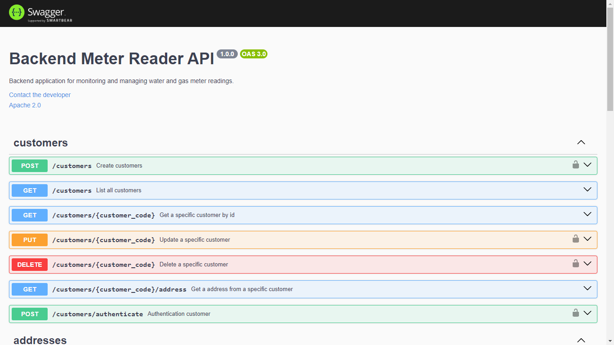

# Backend-meter-reader

Backend application for monitoring and managing water and gas meter readings.

## Libs

* @google/generative-ai
* cpf-cnpj-validator
* cross-env
* debug
* dotenv
* express
* http
* joi
* jsonwebtoken
* md5
* sequelize
* sequelize-typescript
* uuid
* jest
* nodemon
* ts-jest
* supertest

## Code Snippets

* Google Generative AI - Analyzing Image

  ```js
  export const analyzeImage = async(imagesBase64 : string) =>{
      const model = genAI.getGenerativeModel({ model: "gemini-1.5-flash" });
      const promptText = "Read the water meter and return the numeric value";
      const image = {
          inlineData: {
              data: imagesBase64,
              mimeType: "image/png",
          },
      };

      const result = await model.generateContent([promptText, image]);
      return result.response.text();
  }
  ```
* Autentication Service

  ```js
  export const generateToken = async (data: string | object | Buffer) => {
      return jwt.sign(data, SALT_KEY as string, { expiresIn: '1d' });
  };

  export const decodeToken = async (token: string) => {
      const data = await jwt.verify(token, SALT_KEY as string);
      return data;
  };

  export const authorize = (req: any, res: any, next: any) => {
      const token = req.body.token || req.query.token || req.headers['x-access-token'];

      if (!token) {
          res.status(401).json({
              message: 'Acesso Restrito'

          });
      } else {
          jwt.verify(token, SALT_KEY as string, (error: any, decoded: any) => {
              if (error) {
                  res.status(401).json({
                      message: 'Token Inválido'
                  });
              } else {
                  next();
              }
          });
      }
  };
  ```

## Running Test Environment

Defining environment

Change the envoriment variable NODE_ENV in src/envoriment.env file to 'test'

src/envoriment.env

```javascript
SALT_KEY="Ess|vEMVB*oZ:P[v:J+2$41f+ixys*;+4)>(!t*7-!]0/));IF>3siN|ph*~~2j6')'"
PORT='3000'
DB_HOST_TEST='localhost'
DB_HOST='db'
LOCALHOST='localhost'
DB_USER='postgres'
DB_PASSWORD=admin
DB_DATABASE_TEST='measure-database
DB_DATABASE=postgres
DB_PORT=5432
DB_DIALECT='postgres'
NODE_ENV='test'
```

### Installing packages

#### ```npm install```

### Running development

#### ```npm run dev```

## Running Development Environment

### Defining environment

Change the envoriment variable NODE_ENV in src/envoriment.env file to 'development'

src/envoriment.env

```javascript
SALT_KEY="Ess|vEMVB*oZ:P[v:J+2$41f+ixys*;+4)>(!t*7-!]0/));IF>3siN|ph*~~2j6')'"
PORT='3000'
DB_HOST_TEST='localhost'
DB_HOST='db'
LOCALHOST='localhost'
DB_USER='postgres'
DB_PASSWORD=admin
DB_DATABASE_TEST='measure-database
DB_DATABASE=postgres
DB_PORT=5432
DB_DIALECT='postgres'
NODE_ENV='development'
```

### Installing packages

Run on the command line

#### ```npm install```

### Running tests

Run on the command line

#### ```npm test```

## Running on Docker

Defining environment

Change the envoriment variable NODE_ENV in src/envoriment.env file to 'production'

src/envoriment.env

```javascript
SALT_KEY="Ess|vEMVB*oZ:P[v:J+2$41f+ixys*;+4)>(!t*7-!]0/));IF>3siN|ph*~~2j6')'"
PORT='3000'
DB_HOST_TEST='localhost'
DB_HOST='db'
LOCALHOST='localhost'
DB_USER='postgres'
DB_PASSWORD=admin
DB_DATABASE_TEST='measure-database
DB_DATABASE=postgres
DB_PORT=5432
DB_DIALECT='postgres'
NODE_ENV='production'
```

### Running on docker

Run on the command line

```bash
docker compose up -d
```

## Documentation

Run the application and access [http://localhost:3000/docs](http://localhost:3000/docs)

* [ ]  

## Endpoints

### POST /customers

Create new customer

Request Body:

```json
{
        "code": "string",
        "name": "string",
        "email": "string",
        "password": "string",
        "profile_picture": "base64",
        "address": "string",
        "city": "string",
        "district": "srting",
        "country": "string",
        "state": "string",
        "postal_code": "string",
        "phone": "string"
}
```

### GET /customers

Get all customers

### GET /customers/:id

Get customer by Id

### PUT /customers/:id

Update customer

Request Body:

```json
{
        "code": "string",
        "name": "string",
        "email": "string",
        "password": "string",
        "profile_picture": "base64",
        "address": "string",
        "city": "string",
        "district": "srting",
        "country": "string",
        "state": "string",
        "postal_code": "string",
        "phone": "string"
}
```

### DELETE /customers/:id

Delete customer

### POST /customers/authenticate

Customer authentication

Request Body:

```json
{
    "email": "string",
    "password": "string"
}
```

### GET /customers/:id/address

Get customer's address

### POST /addresses

Create a new address

Request Body:

```json
{
    "address": "string",
    "city": "string",
    "district": "string",
    "country": "string",
    "state": "string",
    "postal_code": "string",
    "phone": "string",
    "customer_code": "string"
}
```

### GET /adresses

Get all addresses

### GET /addresses/:id

Get address by id

### PUT /addresses/:id

Update a address

Request Body

```json
{
    "address": "string",
    "city": "string",
    "district": "string",
    "country": "string",
    "state": "string",
    "postal_code": "string",
    "phone": "string",
    "customer_code": "string"
}
```

### DELETE /addresses/:id

Delete a address

### POST /upload

Create a new measure

Request Body

```json
{
    "image": "base64",
    "customer_code": "string",
    "measure_datetime": "datetime",
    "measure_type": "GAS" or "WATER"
}
```

### GET /measures

Get all addresses

### GET /measure/:id

Get address by id

### GET /:id/list

List all measures by customer id

### PUT /measure/:id

Update a address

Request Body

```json
{
    "image": "base64",
    "customer_code": "string",
    "measure_datetime": "datetime",
    "measure_type": "GAS" or "WATER"
}
```

### PATCH /confirm

Confirm a measure value

Request Body

```json
{
    "measure_uuid":"string",
    "confirmed_value": integer
}
```

### DELETE /measures/:id

Delete a measure
